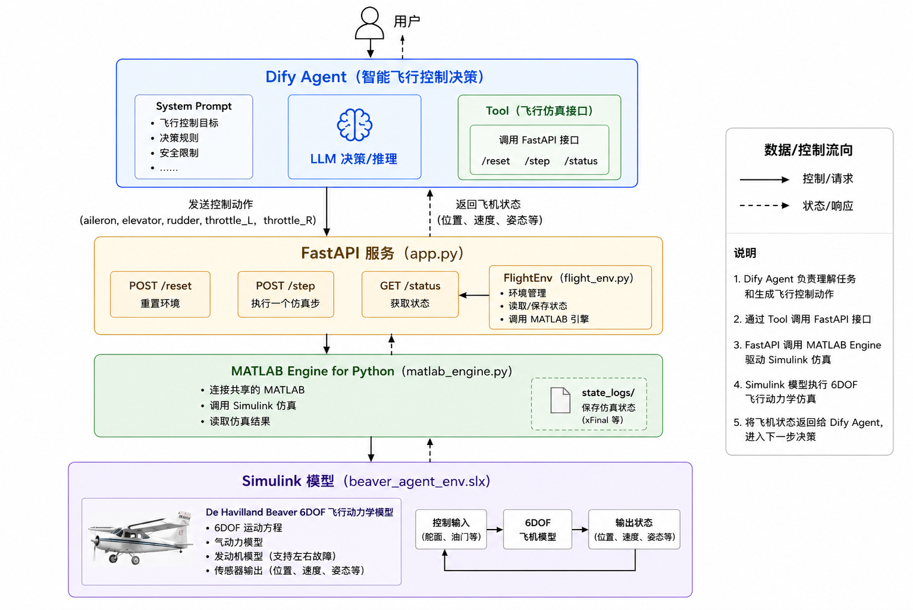
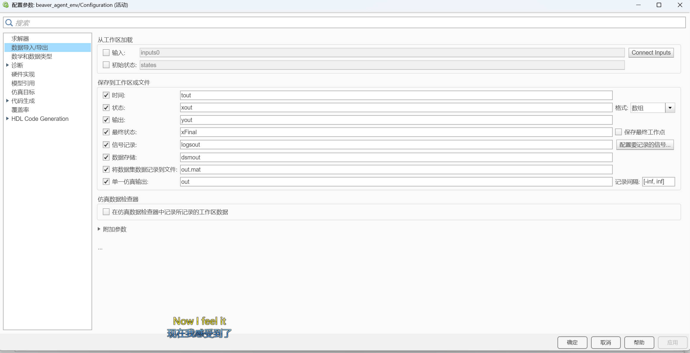

# 6DOF Airframe

基于 Dify Agent、Python、MATLAB/Simulink 的飞机 6DOF 智能控制仿真项目。

---

## 一、运行环境

* Windows
* Python 3.9
* MATLAB R2022a
* Simulink
* Dify
* Docker（用于本地部署 Dify）

---

## 二、项目结构

```text
6DOF_Airframe/
├── simulink/                  # MATLAB/Simulink 6DOF 仿真模型
├── state_logs/                # 仿真状态
├── dify_agent_DSL/            # Dify Agent DSL 配置文件
│   └── 6DOF_Airframe.yml      # Dify Agent 导入文件
├── app.py                     # FastAPI 服务入口
├── config.py                  # 基本配置
├── flight_env.py              # 飞行仿真环境
├── matlab_engine.py           # MATLAB Engine 接口
├── models.py                  # API 数据模型
├── visualization.py           # 仿真结果可视化
├── requirements.txt           # Python 依赖
└── README.md                  # 项目说明
```

---

## 三、快速开始

本项目建议按照以下顺序进行配置和启动：

**Dify Agent → Python 环境 → MATLAB/Simulink → 开始仿真**

具体流程如下：

```text
Dify Agent 配置
       ↓
Python 环境及脚本配置
       ↓
MATLAB / Simulink 配置
       ↓
启动 MATLAB Engine
       ↓
启动 FastAPI
       ↓
开始 Dify Agent 仿真
```

---

## 四、配置 Dify Agent
提供了 Dify Agent DSL 配置文件：
```text
dify_agent_DSL/
└── 6DOF_Airframe.yml
```

### 1. 启动 Dify
首先启动本地 Dify。
如果使用 Docker 部署 Dify，请确保 Dify 服务能够正常访问。
### 2. 导入 Agent

进入 Dify 管理界面，选择 **导入 DSL / Import DSL**，然后导入项目中的：
`dify_agent_DSL/6DOF_Airframe.yml`
导入完成后，Dify 会根据 YAML 文件自动创建本项目所需的 Agent。
### 3. Dify 自定义工具 Schema

项目中的 `schema` 文件用于配置 Dify Agent 的自定义工具。

在 Dify 中进入：

工具 → 自定义工具 → 导入/创建工具

然后使用项目提供的 `schema` 文件进行配置。

导入完成后，Agent 即可通过该工具调用本地 FastAPI 服务，
实现与 MATLAB/Simulink 飞行仿真环境的通信。

> 注意：导入 Schema 后，需要根据本机 FastAPI 的实际地址检查工具的 API 地址配置。
### 4. 修改 Agent
如果需要调整 Agent 的飞行控制策略，可以直接在 Dify Agent 的 **System Prompt** 中进行修改。
可以根据实际需求调整：

* 飞行状态分析规则
* 控制决策逻辑
* 故障处理策略
* 控制动作输出格式
* Agent 安全约束

修改完成后保存即可重新进行仿真。

---

## 五、配置 Python（控制脚本tool）

完成 Dify Agent 配置后，配置 Python 仿真环境。

### 1. 安装 Python 依赖

建议使用 Python 3.9。
安装`requirements.txt`主要依赖。

### 2. 启动 FastAPI
Python 环境配置完成后，运行`app.py`：

默认情况下，FastAPI 服务运行在：

`http://127.0.0.1:8000`

FastAPI 负责接收 Dify Agent 的控制请求，并将控制动作传递给 Python 飞行仿真环境。

---

## 六、配置 MATLAB / Simulink
### 1. 模型参数设置
打开 **MATLAB R2022a**。
进入项目中的 `simulink/` 目录，打开`beaver_agent_env.slx`模型，`Ctrl+E`调出参数设置：



### 3. 启动 MATLAB Engine

在 MATLAB 命令窗口执行：`matlab.engine.shareEngine`执行完成后保持 MATLAB 开启。
此时 Python 程序即可通过 MATLAB Engine 连接当前 MATLAB 会话。

---

## 七、启动项目并进行仿真

完成 Dify、Python 和 MATLAB/Simulink 的配置后，即可开始运行项目。
1. 打开matlab，命令窗口输入：`matlab.engine.shareEngine`
2. 运行`app.py`即可在dify中仿真。
---

## 八、注意事项

1. **MATLAB R2022a 必须保持运行**，并在 Python 使用 MATLAB Engine 前完成共享。
2. 启动 Python 服务前，应确保 Simulink 模型可以正常打开。
3. FastAPI 运行期间不要关闭 Python 服务终端。
4. 如果 Dify 使用 Docker 部署，而 FastAPI 运行在宿主机上，Dify Tool 应使用 `host.docker.internal` 访问 FastAPI。
5. 如果修改 FastAPI 端口，需要同步修改 Dify Agent Tool 中的请求地址。
6. `6DOF_Airframe.yml` 用于快速部署本项目的 Dify Agent。导入后建议检查 Tool 地址是否与当前运行环境一致。
7. 如果更换计算机或项目路径，需要根据本机的 MATLAB、Python 和 Dify 环境进行相应配置。
8. MATLAB、FastAPI 和 Dify 在仿真过程中需要保持正常运行。

---
